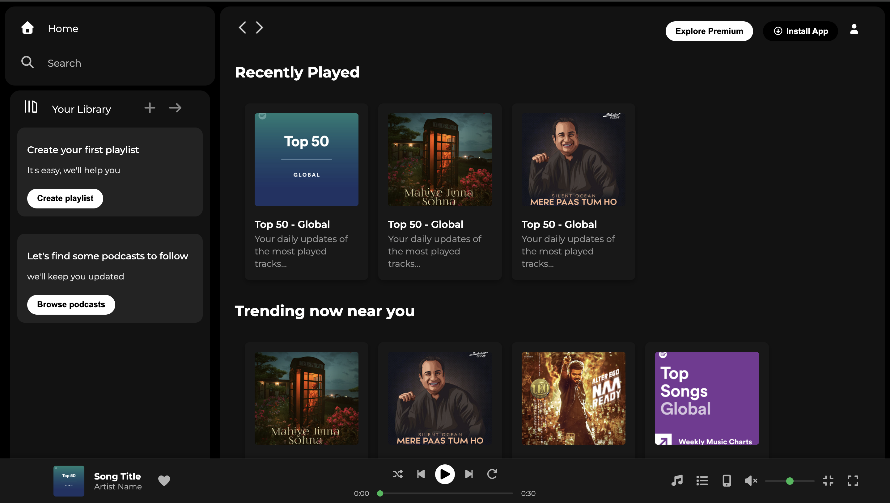
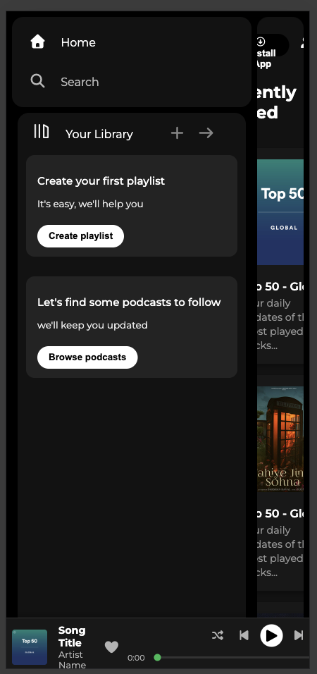

# Minor-Project: Spotify Clone 🎵

A sleek, responsive Spotify-inspired webpage built to showcase modern frontend development skills.

## Demo Gif

## 🚀 Features
* **Fully Responsive:** Works perfectly on Desktop, Tablet, and Mobile.
* **Interactive UI:** Hover effects on song cards and play buttons.
* **Music Player:** Fixed bottom player bar with progress tracking.
* **Font Awesome Integration:** Clean, recognizable iconography.

## 📸 Screenshots
| Desktop View                 
|-------------------------------------------------
|  | 

📸 Mobile View 

## 🛠️ Tech Stack
* **HTML5** - Structure
* **CSS3** - Styling & Animations
* **Font Awesome** - Icons

## ⚙️ How to Run
1. Clone the repository:
   `git clone https://github.com/Nikkiraj4/Minor-Project.git`
2. Open `OpenInBrowser.html` in your favorite browser.
